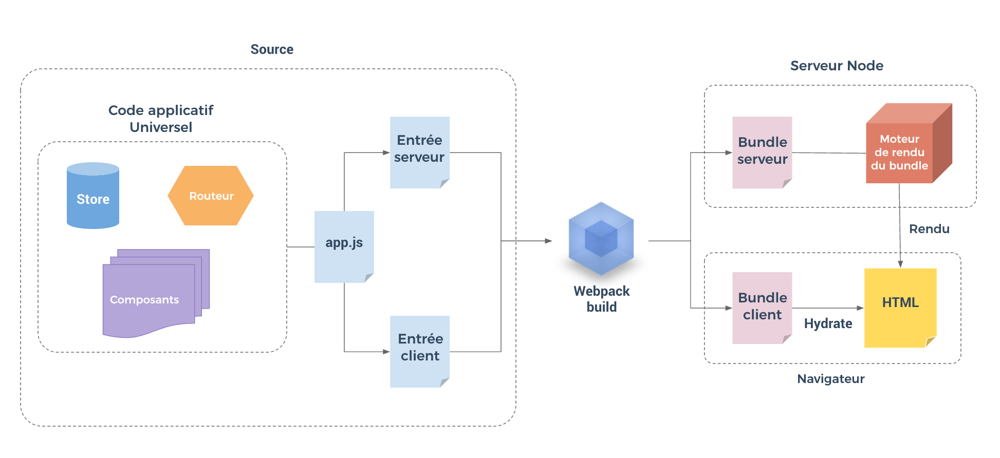

> Berikut adalah tiruan HackerNews yang dibuat berdasarkan Firebase APi resmi dari HackerNews, Vue 2.0 + Vue Router + Vuex, dengan server-side rendering.



  



> [Live Demo](https://vue-hn.herokuapp.com/)
> Catatan: demo mungkin akan membutuhkan waktu muat ketika tidak seorangpun mengaksesnya dalam beberapa jangka waktu.
>
> [[Kode sumber](https://github.com/vuejs/vue-hackernews-2.0)]

## Fitur

- Server Side Rendering
  - Vue + Vue Router + Vuex bekerja bersama
  - Server-side data pre-fetching
  - Client-side state & DOM hydration
- Single-file Vue Components
  - Hot-reload dalam pembangunan
  - Ekstaksi CSS untuk produksi
- Perbaruan secara waktu nyata dengan animasi FLIP

## Ikhtisar Arsitektur

